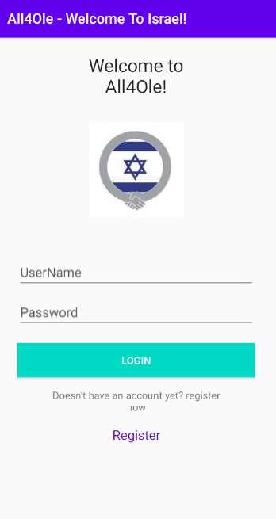
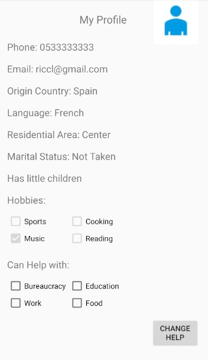

# All4Ole-Client

Build For Good, Apps Flyer's mobile app challenge 

Created by: Gilad Asher, Israel Shai and Avital Zehavi 

## Preview

Based on a real need of Olim that having difficulties adapting to Israel, we have developed an app that will help them adapt to Israel (it can also work for every other country) 
and make it easier for them, by veteran olim who have already settled in the country.

Olim who need help or company in any field they want, can get information and access the profiles of other Olim who can help them and satisfy their needs.

## Program explanation

The server is implemented in ASP .NET Core Framework  that accesses a remote MySQL database, consists of registered 
users. The server is currently running on AWS Cloud. The front-end was built in Android Studio in Kotlin, making the connection to the server, implementing the MVC Design Pattern. 
 

 
### Login & Registration

The main activity of the app is the login screen, in which the user is typing his username and password to get in. 

If it is a new user, he can register to the app, inserting username, password, email, first and last name, phone number, origin country, and language.
He can also choose his hobbies and subjects he can help with.

We implemented the multiple choice of hobbies and topics using bitwise so that each bit represents a different hobby or help topic.

### Home Page And App's Usage

For example, assume the user Ricardo010 (password Rj1231) logins to the app. 

First of all, he can view his profile, also being able to see his hobbies and subjects he can help. 

If he needs help with bureaucracy, for example filling out forms, he can look for Olim to help him with this issue.
Then he finds Mila Levi and two others that can help him.

In the same way, he can find olim sharing specific hobby, or even "people like him". 
By clicking on any result of Ole, he can view his or her profile. 

We all hope that the app will help the new Olim and that they will get the most out of it.

